

# PA4 Submission: TaskFlow Pipeline

Copy this file to <code style="color:#111827;background:#ddd6fe;padding:2px 4px;border-radius:4px;">SUBMISSION.md</code>. Put every screenshot in <code style="color:#111827;background:#ddd6fe;padding:2px 4px;border-radius:4px;">docs/</code>, embed it under the correct task, and write a short description below each image explaining what it proves. The grader should not need any file outside this repository.

## Student Information

| Field | Value |
|---|---|
| Name | <!-- TODO: Your Full Name --> |
| Roll Number | <!-- TODO: e.g. 27100445 --> |
| GitHub Repository URL | <!-- TODO: https://github.com/YOUR_USERNAME/CS487-PA4 --> |
| Resource Group | `rg-sp26-<!-- TODO: rollnum -->` |
| Assigned Region | <!-- TODO: `uaenorth` or `ukwest` --> |

## Evidence Rules

- Use relative image paths, for example: ``.
- Every image must have a 1–3 sentence description below it.
- Azure Portal screenshots must show the resource name and enough page context to identify the service.
- CLI screenshots must show the command and output.
- Mask secrets such as function keys, ACR passwords, and storage connection strings.

---

## Task 1: App Service Web App (15 points)

### Evidence 1.1: Forked Repository

This is my personal fork of the PA4 starter repository. It contains the full starter structure including `webapp/`, `function-app/`, `validate-api/`, and `report-job/` directories. All subsequent work was committed and pushed to this fork.

---

### Evidence 1.2: App Service Overview

The Web App `pa4-<rollnum>` is deployed in resource group `rg-sp26-<rollnum>` in the `<!-- region -->` region, running on the Node 20 LTS runtime stack. The status shows **Running** and the public URL is `https://pa4-<rollnum>.azurewebsites.net`.

---

### Evidence 1.3: Deployment Center / GitHub Actions

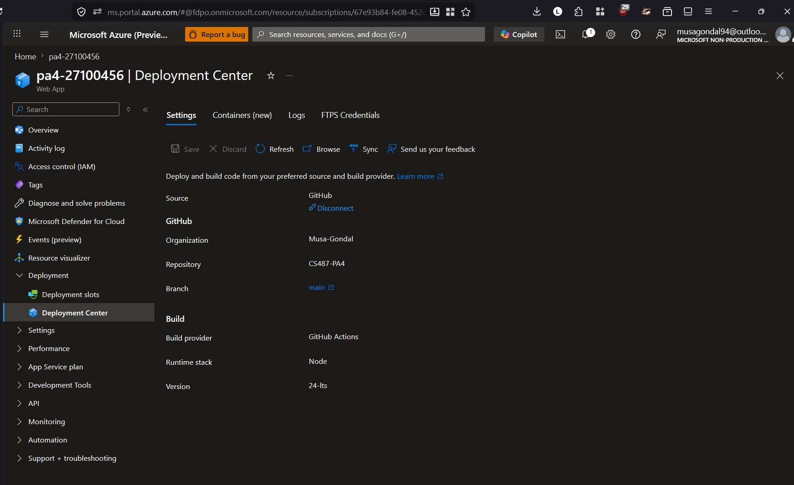
The Web App is connected to my GitHub fork via the Azure Deployment Center using GitHub Actions. The workflow automatically triggers on every push to the `main` branch and deploys the `webapp/` directory to App Service.

---

### Evidence 1.4: Live Web UI

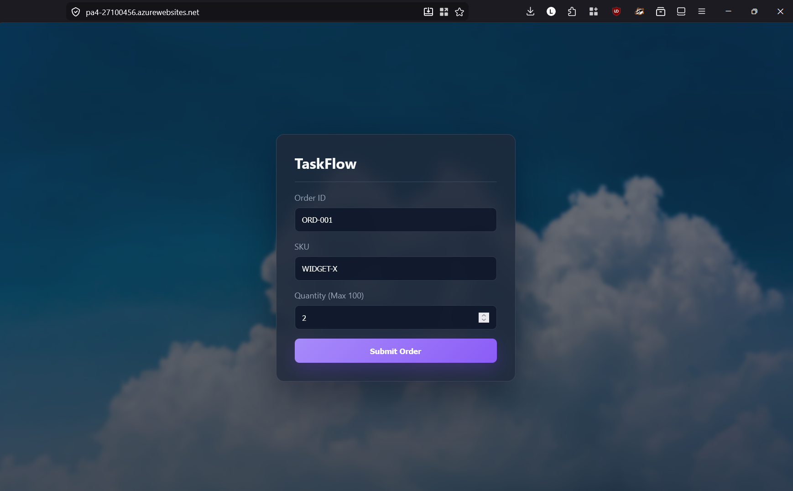

The App Service is successfully serving the TaskFlow frontend. The Submit Order form and Status panel are visible. At this stage, submitting an order shows a configuration error because the Durable Function has not yet been wired up — this is expected behaviour.

---

## Task 2: Azure Container Registry (15 points)

### Evidence 2.1: ACR Overview

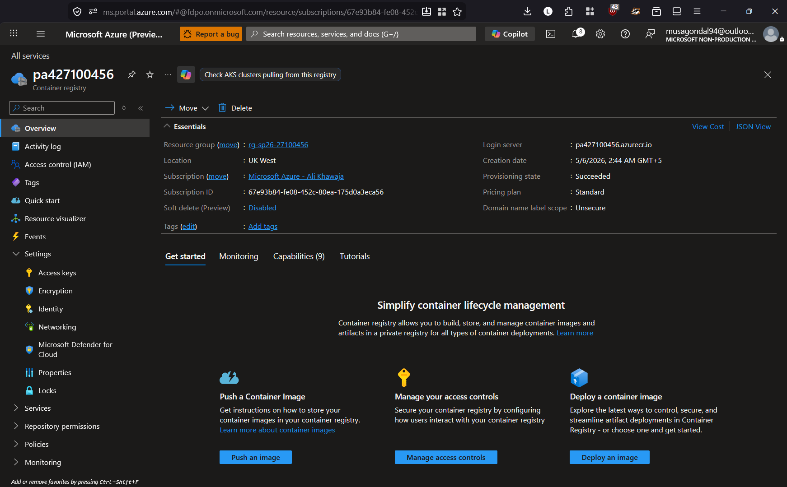

The Container Registry `pa4<rollnum>` is provisioned in resource group `rg-sp26-<rollnum>` using the **Basic** SKU. The admin user is enabled to allow image pulls from AKS and ACI using username/password credentials.

---

### Evidence 2.2: Docker Builds

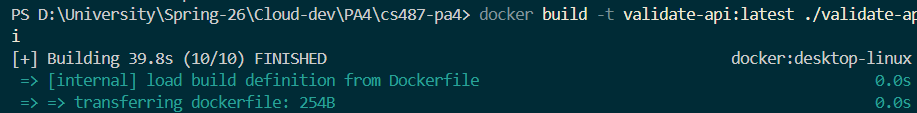
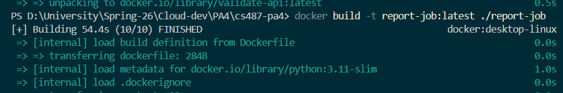
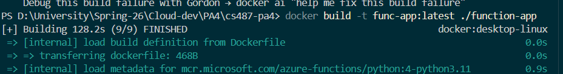

Three images were built locally: `validate-api` from `validate-api/`, `report-job` from `report-job/`, and `func-app` from `function-app/`. All builds completed successfully with no errors.

---

### Evidence 2.3: ACR Repositories

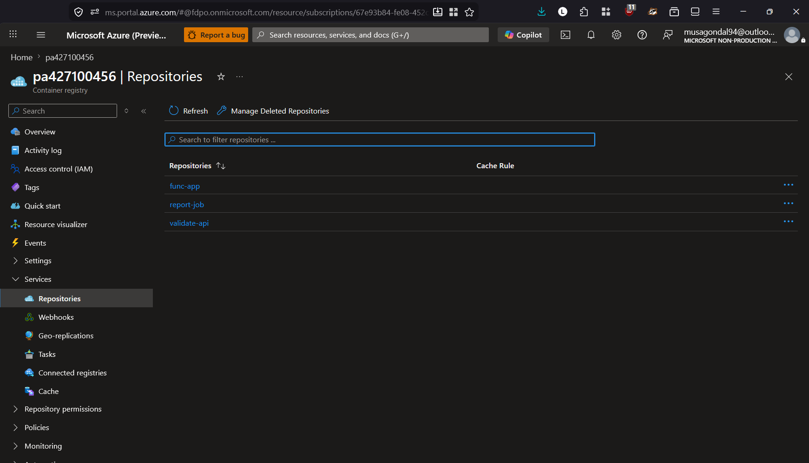

All three images have been successfully pushed to the registry: `validate-api:v1`, `report-job:v1`, and `func-app:v1`. The output of `az acr repository list` confirms their presence in `pa4<rollnum>`.

---

## Task 3: Durable Function Implementation (12 points)

### Evidence 3.1: Completed Function Code

Completed implementation: [`function-app/function_app.py`](function-app/function_app.py)

The orchestrator chains two activities sequentially. It first calls `validate_activity`, which POSTs the order to the AKS validator and returns a `{valid, reason}` result. If `valid` is `false`, the orchestrator immediately returns `{status: rejected}`. If `valid` is `true`, it calls `report_activity`, which uses the Azure SDK to create an ACI running the `report-job` image, polls until the container reaches `Succeeded`, deletes the ACI to stop billing, and returns the blob URL of the generated PDF.

---

### Evidence 3.2: Local Function Handler Listing

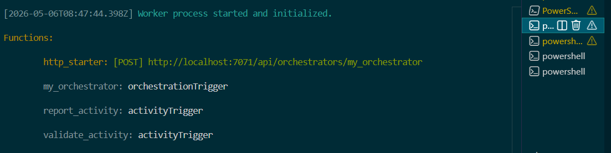

The Durable Functions runtime discovered and registered all four handlers: the HTTP starter (`http_starter`), the orchestrator (`my_orchestrator`), and both activity functions (`validate_activity`, `report_activity`). This confirms the code is syntactically correct and the decorators are wired properly.

---

## Task 4: Function App Container Deployment (8 points)

### Evidence 4.1: Function App Container Configuration

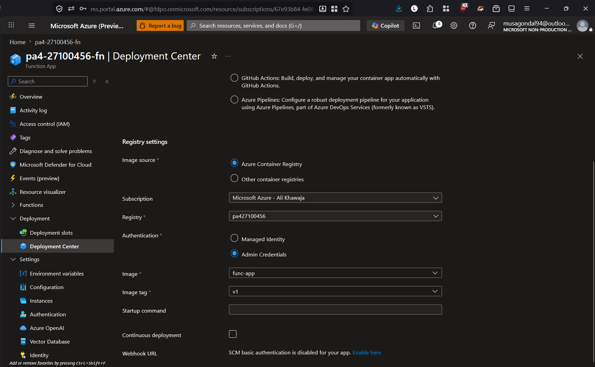

The Function App `pa4-<rollnum>` is configured to pull its container image from `pa4<rollnum>.azurecr.io/func-app:v1`. The hosting plan reuses the `pa4-<rollnum>` App Service Plan created in Task 1.

---

### Evidence 4.2: Orchestration Smoke Test

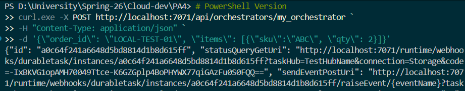

The `curl` POST to the deployed HTTP starter returned a JSON response containing an `id` (the orchestration instance ID) and a `statusQueryGetUri`. This proves the Function App container is running and the Durable HTTP starter is reachable over HTTPS.

---

### Evidence 4.3: Expected Failed Status Before Downstream Wiring

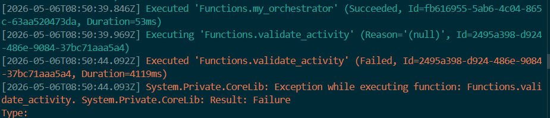

The orchestration shows `runtimeStatus: "Failed"` with an error indicating `VALIDATE_URL` is not configured. This is the expected checkpoint at this stage — it proves the orchestrator started, checkpointed, and attempted to invoke `validate_activity`, but could not reach the AKS validator because Task 5 has not yet been completed.

---

## Task 5: AKS Validator (15 points)

### Evidence 5.1: AKS Cluster

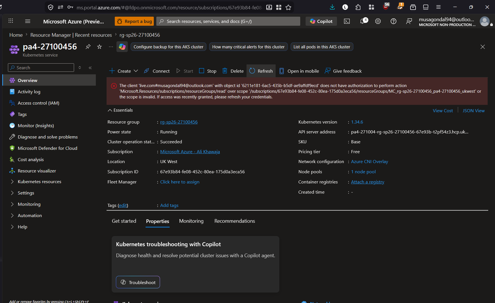

The AKS cluster `pa4-<rollnum>` is provisioned in resource group `rg-sp26-<rollnum>` in the `<!-- region -->` region with **1 node** of size `Standard_B2s`. The provisioning state shows **Succeeded**.

---

### Evidence 5.2: Kubernetes Nodes and Pods

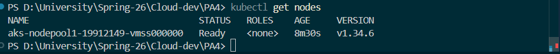
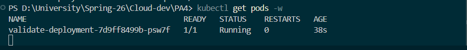

`kubectl get nodes` shows one node in `Ready` state. `kubectl get pods` shows the `validate-api` pod is scheduled and in `Running` status, confirming the Deployment was applied successfully.

---

### Evidence 5.3: Kubernetes Service

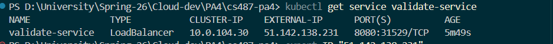

The `validate-service` of type `LoadBalancer` has been assigned an external IP by Azure. Port `8080` is exposed publicly, which is the endpoint the Durable Function calls for order validation.

---

### Evidence 5.4: Validator API Tests

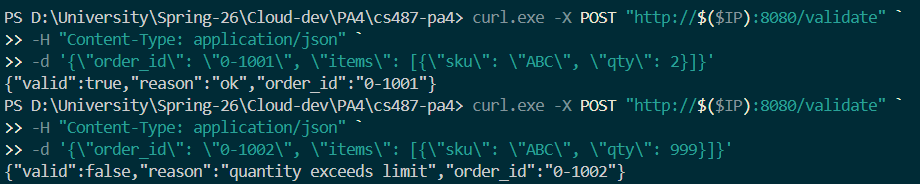

`GET /health` returns a healthy response. A valid order with `qty=2` returns `{"valid": true, "reason": "ok"}`. An order with `qty=999` (exceeding the 100-unit limit) returns `{"valid": false, "reason": "quantity exceeds limit"}`. Both the accept and reject paths are working correctly.

---

### Evidence 5.5: Function App `VALIDATE_URL`

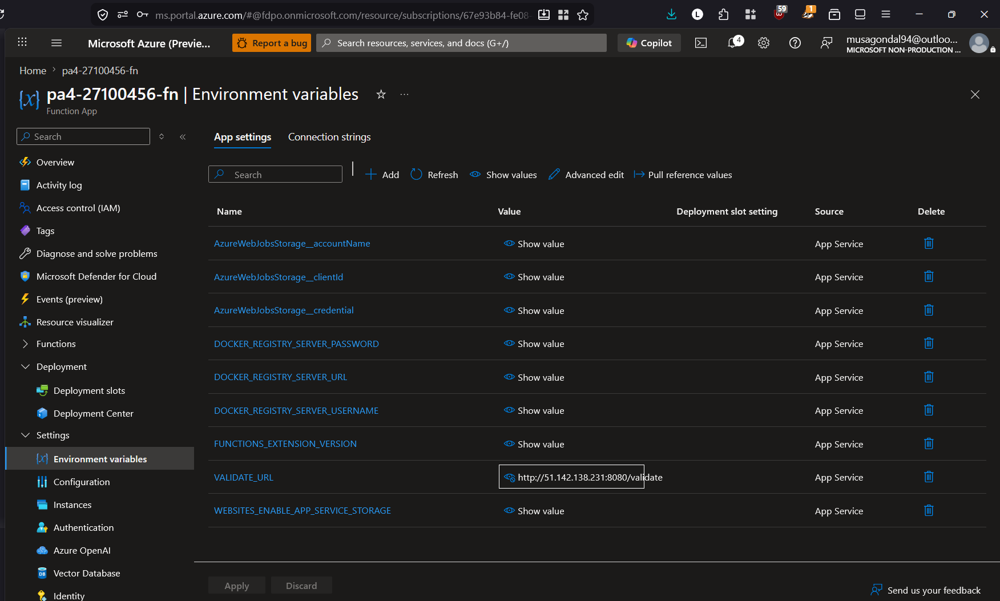

The `VALIDATE_URL` application setting has been set on the Function App, pointing to `http://<AKS-EXTERNAL-IP>:8080/validate`. This allows `validate_activity` to reach the AKS-hosted validator at runtime without hardcoding the IP in code.

---

### Evidence 5.6: AKS Idle Behavior

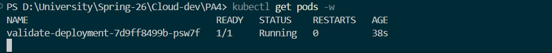

Unlike ACI, the AKS node continues running even when no orders are being processed. The pod remains in `Running` state and the node keeps billing. This is the fundamental operational difference between AKS (always-on, persistent endpoint) and ACI (per-invocation, exits after work is done).

---

## Task 6: ACI Report Job (15 points)

### Evidence 6.1: Blob Container

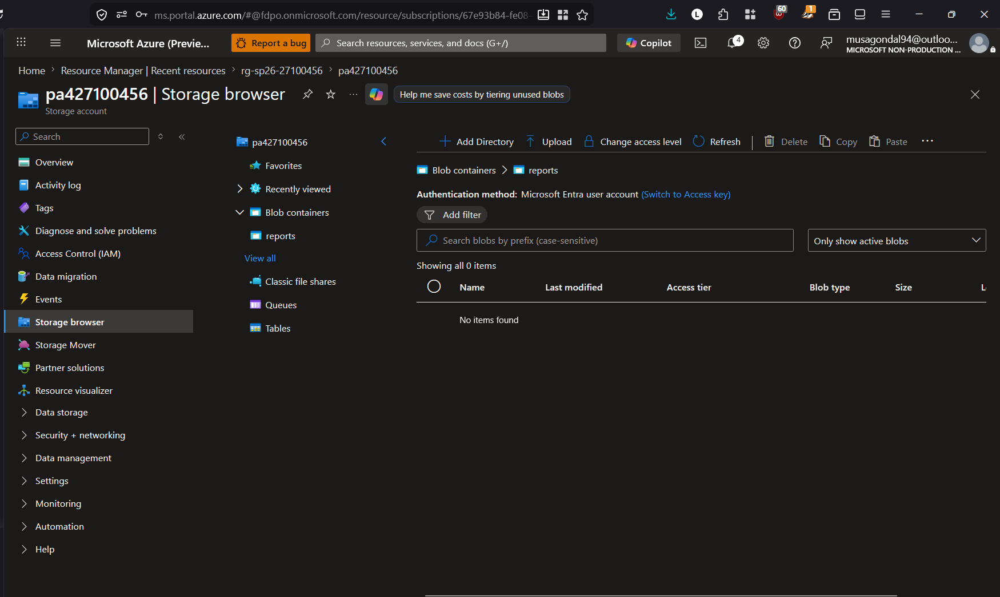

The `reports` blob container has been created in the `pa427100456` storage account. This is where the `report-job` ACI writes its generated PDF output after each successful order run.

---

### Evidence 6.2: Manual ACI Run

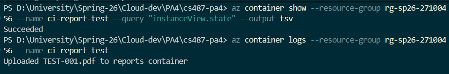

The manually created ACI `ci-report-test` ran the `report-job:v1` image and transitioned to **Succeeded** state. The container has exited as expected — ACI's one-shot lifecycle means it terminates automatically after the job completes, with no idle billing.

---

### Evidence 6.3: ACI Logs

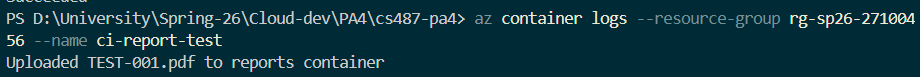

The container logs show the `report-job` printed its PDF generation progress and a confirmation that the file was uploaded to blob storage. This proves the container ran the report generation logic end-to-end and wrote its output successfully.

---

### Evidence 6.4: Generated PDF

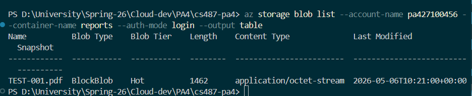

`TEST-001.pdf` is visible in the `reports` blob container. This confirms the ACI container was able to authenticate to blob storage via the managed identity and write its output — proving the full ACI → Blob write path is functional.

---

### Evidence 6.5: Function App Managed Identity and IAM

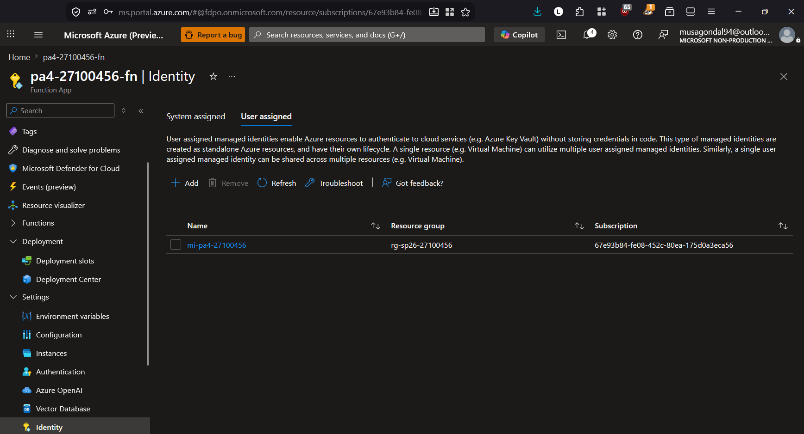

The user-assigned managed identity `mi-pa4-<rollnum>` has been attached to the Function App via the Identity → User assigned blade. This identity has been pre-provisioned by the instructor with the necessary permissions, allowing `report_activity` to create ACIs at runtime using `DefaultAzureCredential` — no secrets stored in code or config.

---

### Evidence 6.6: Report App Settings

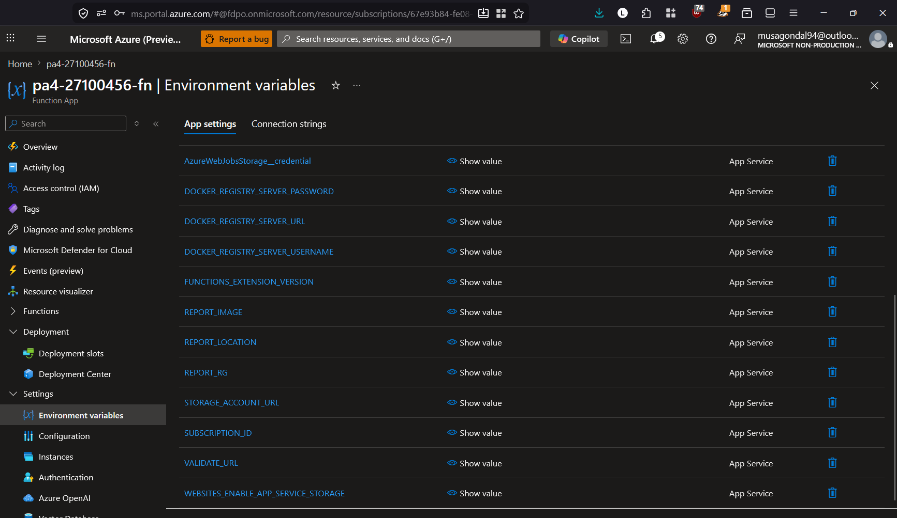

The Function App has been configured with all required settings. The `REPORT_IMAGE`, `ACR_SERVER`, `ACR_USERNAME`, and `ACR_PASSWORD` settings (password masked) allow `report_activity` to supply registry credentials when creating the ACI. `STORAGE_ACCOUNT_URL` tells the report-job container where to write its PDF. `REPORT_RG`, `REPORT_LOCATION`, and `SUBSCRIPTION_ID` are used by the Azure SDK client to create ACI resources in the correct subscription and location.

---

## Task 7: End-to-End Pipeline (15 points)

### Evidence 7.1: Web App Wiring

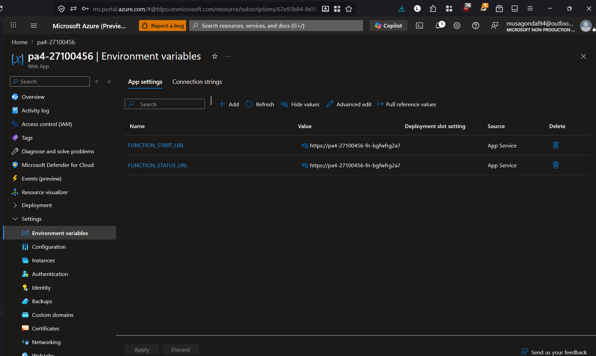

`FUNCTION_START_URL` is set to the HTTP starter URL including the function key, and `FUNCTION_STATUS_URL` is set to the Durable status query base URL. The frontend uses `FUNCTION_START_URL` to POST new orders and `FUNCTION_STATUS_URL` to poll orchestration status until it reaches `Completed` or `Failed`.

---

### Evidence 7.2: Happy Path UI

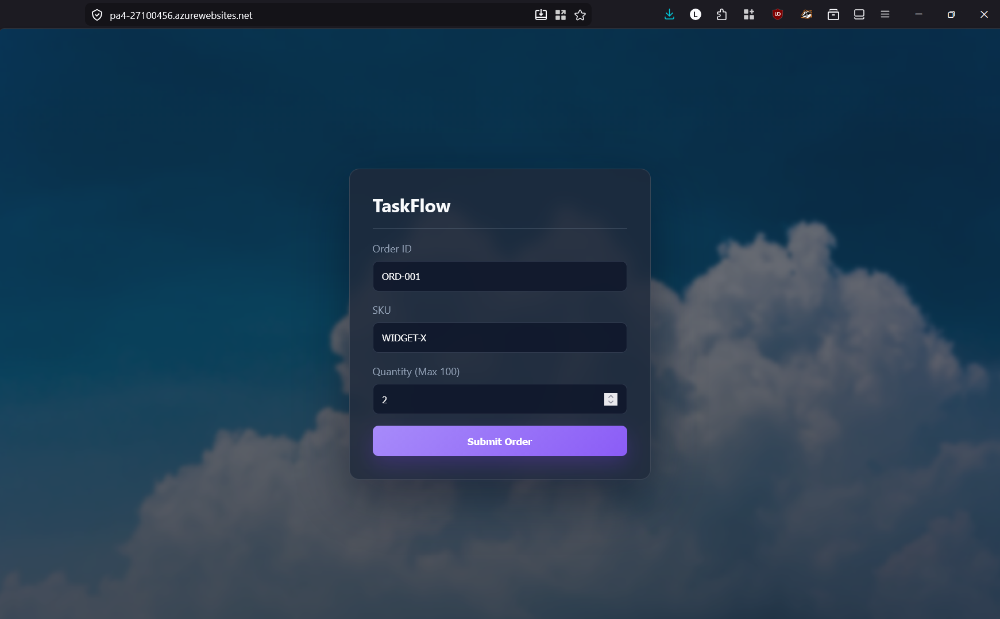

The form is filled with a valid order: `qty=2`, a SKU, and a unique order ID. The quantity is well within the 100-unit limit so the validator will accept it.

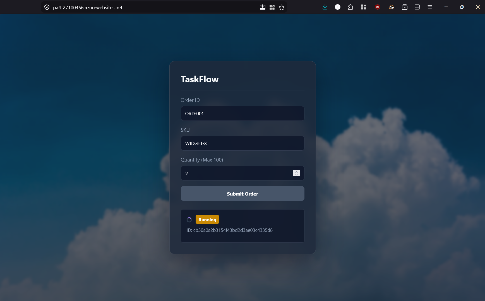

Immediately after submission, the Status panel shows `Running` along with the live orchestration instance ID. The frontend is polling the Durable status URL every few seconds.

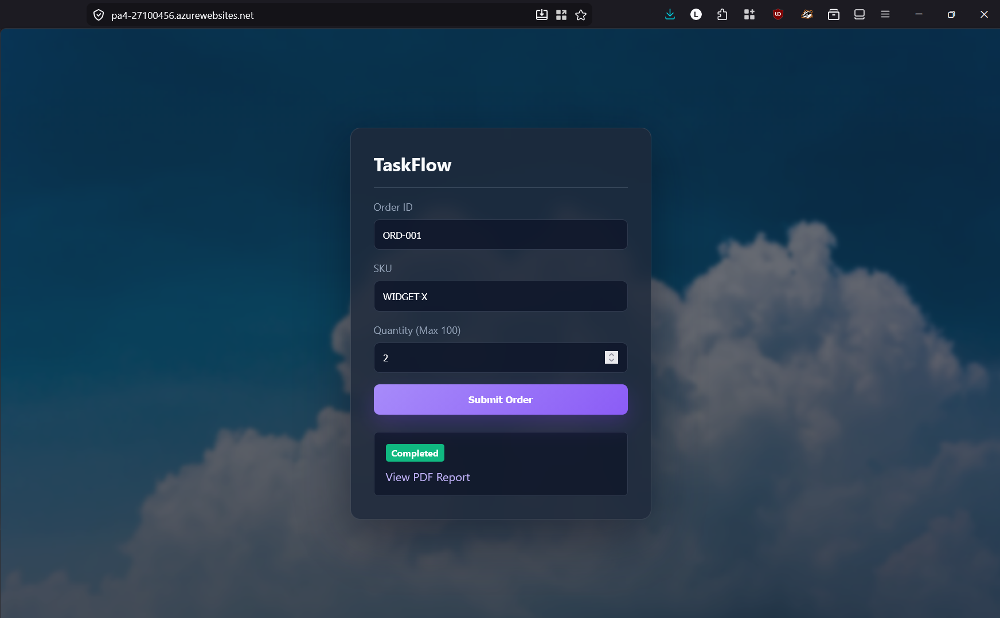

The orchestration reached `Completed` status and the UI displays the report URL pointing to the generated PDF in blob storage. The full pipeline — Web App → Durable Function → AKS validator → ACI report job → Blob Storage — completed successfully within ~60 seconds.

The PDF generated by the `report-job` container is accessible and can be downloaded directly from the blob URL returned in the UI.

---

### Evidence 7.3: Backend Participation

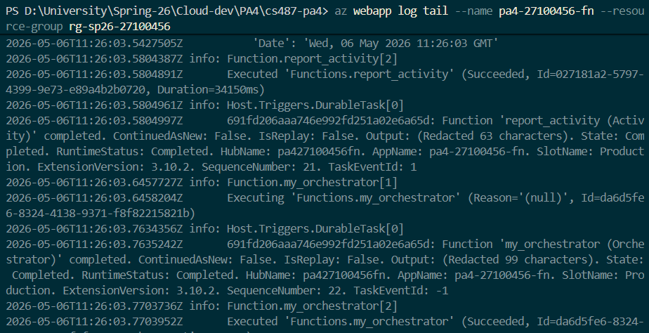

The Function App invocation log shows the HTTP starter, orchestrator, `validate_activity`, and `report_activity` all executed for the same orchestration instance ID, confirming the full chain ran.

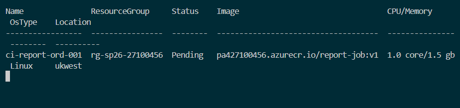

`az container list` shows an ACI named `ci-report-<order_id>` was created by `report_activity` during the run. After the job completed, the activity called `begin_delete` so the container was automatically cleaned up.

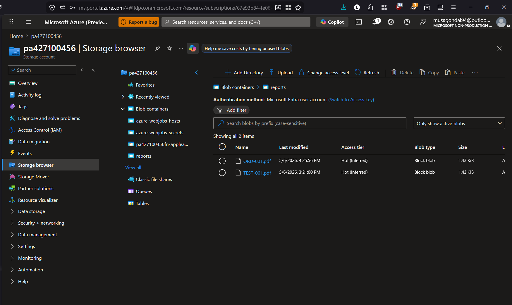

The `reports` blob container now contains a PDF named `<order_id>.pdf` that matches the order submitted in the UI, confirming the ACI successfully wrote its output to blob storage.

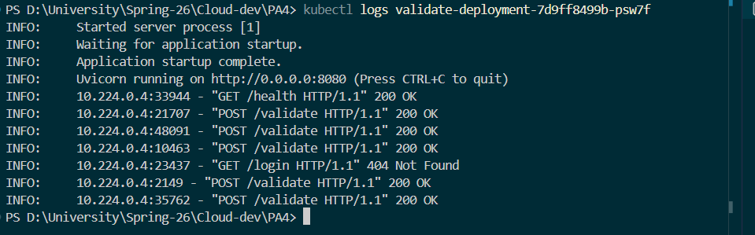

AKS metrics or pod logs show the `validate-api` pod received and processed the HTTP POST from `validate_activity` during the run, confirming the AKS-hosted validator participated in the pipeline.

---

### Evidence 7.4: Reject Path UI

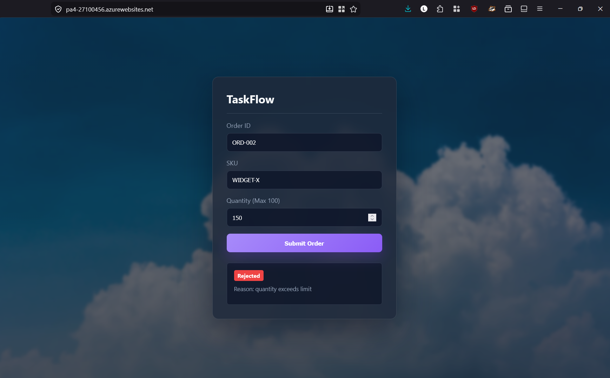

An order submitted with `qty=150` was rejected by the validator. The UI displays the rejection reason (`quantity exceeds limit`) returned by the orchestrator's `{status: rejected}` response.

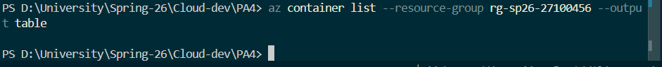

`az container list` confirms no ACI was created for the rejected order ID. The orchestrator short-circuited correctly: because `validate_activity` returned `valid: false`, `report_activity` was never called.

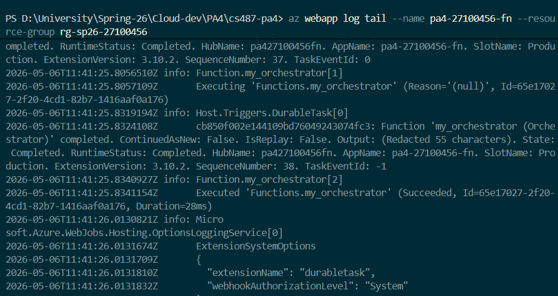

The Function App invocation log shows the orchestration for the rejected order completed **Successfully** (from the orchestrator's perspective — it ran to completion without throwing). The output payload contains `"status": "rejected"`, confirming the conditional branch worked as intended.

---
## Overall Resource Group Screenshot
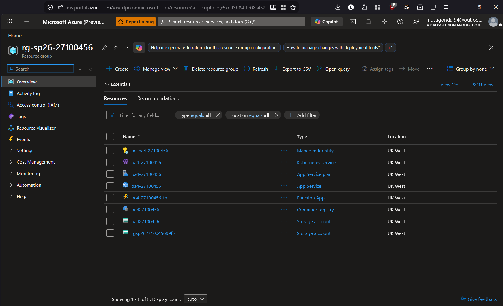

---
## Task 8: Write-up and Architecture Diagram (5 points)

### Evidence 8.1: Architecture Diagram

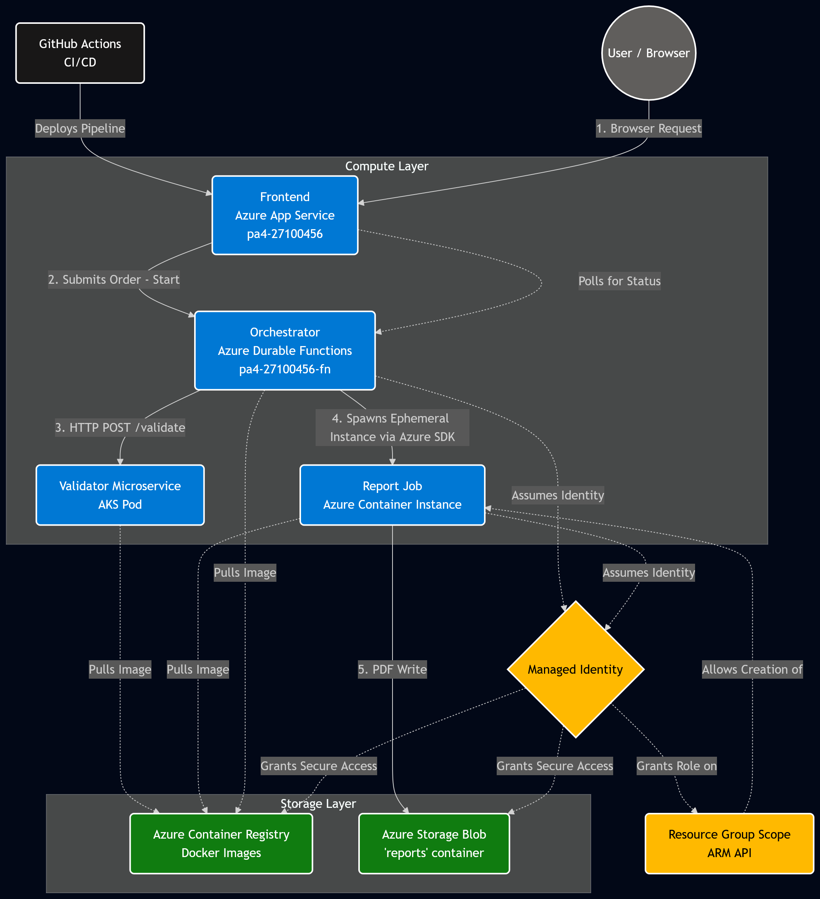

The diagram shows the full TaskFlow pipeline: GitHub → App Service (CI/CD), browser → App Service → Durable Function (start + poll), Durable Function → AKS validator (HTTP `/validate`), Durable Function → ACI report job (Azure SDK, ephemeral per run), ACI → Blob Storage (PDF write), and ACR supplying images to the Function App, AKS, and ACI. The managed identity relationship between the Function App and the resource group (for ACI creation) is also shown.

---

### Question 8.2: Service Selection

**App Service** is the right choice for the web dashboard because it hosts a long-running, stateful Node.js server that needs a stable HTTPS endpoint, persistent process memory, and direct GitHub CI/CD integration. Unlike serverless options, App Service keeps the server warm so the UI responds instantly without cold-start delays, which is important for a frontend users interact with directly.

**Durable Functions** is the right choice for the orchestrator because the pipeline is a sequential multi-step workflow that can take up to a minute. Durable Functions checkpoints state between activities, meaning if the runtime restarts mid-run the orchestrator replays without re-executing completed steps. A plain HTTP function has no persistence layer, making it impossible to safely coordinate a two-step workflow where step two depends on step one's result.

**AKS** is the right choice for the validator because it is a long-lived HTTP microservice that must be available at a stable endpoint for every order. AKS provides a persistent LoadBalancer IP, declarative Kubernetes deployments with pod health checks, and the ability to scale replicas if order volume increases. The validator must always be reachable when an order arrives — ACI would create a new container per request (cold start latency) and cannot expose a persistent service endpoint.

**ACI** is the right choice for the report job because it is a short-lived batch task: it starts, generates a PDF, writes it to blob, and exits. ACI bills only while the container is running, so a job that takes 20 seconds costs fractions of a cent. Keeping this as a permanently-running AKS workload would waste compute 24/7 on a task that only runs on demand. ACI's ephemeral, per-invocation lifecycle is a perfect match for a one-shot batch job.

---

### Question 8.3: ACI vs AKS

**Idle behavior:** When AKS is idle (no orders arriving), the node VM (`Standard_B2s`) continues running and billing at its hourly rate — the validator pod stays scheduled regardless of traffic. There is no concept of "scale to zero" for the AKS node in this configuration. For ACI in this pipeline, "idle" is meaningless: the container only exists while a report is being generated. Between orders, no ACI exists at all, so there is zero idle cost.

**Cost behavior:** AKS incurs a fixed hourly cost for the node whether or not orders are flowing. ACI cost is strictly proportional to actual usage (vCPU-seconds × GB-seconds). For high-frequency, short workloads ACI is dramatically cheaper; for a service that must respond to every request with sub-second latency, AKS's always-on cost is justified.

**If a malicious user spammed 1000 orders per minute:** AKS would see 1000 `/validate` requests hit the single pod — it would handle them in parallel but the node cost does not change (it is fixed). ACI would create up to 1000 container instances, each billing for its runtime. ACI would incur the most additional cost in this scenario because every request spawns a billable container, while AKS absorbs extra requests with no additional cost beyond the existing node.

---

### Question 8.4: Durable Functions vs Plain HTTP

**Problem 1 — Function timeouts and state persistence:** A plain HTTP-triggered Azure Function on the Consumption plan has a maximum execution timeout of 5–10 minutes (and 230 seconds for HTTP responses). The report step alone can take up to a minute; combined with validation and polling, a single chained HTTP call would risk timeout. Durable Functions solves this by persisting orchestration state to storage and replaying the orchestrator, allowing the workflow to span arbitrary time without holding an open HTTP connection.

**Problem 2 — No retry-on-failure or replay safety:** If `report_activity` fails mid-run (e.g., ACI creation throttled), a plain HTTP chain has no built-in retry mechanism — the caller gets a 500 and the order is lost. Durable Functions automatically retries failed activities (with configurable back-off) and replays the orchestrator deterministically, guaranteeing that already-completed steps (like validation) are not re-executed. This idempotency guarantee is impossible to implement correctly in a raw HTTP call chain without significant custom code.

---

### Question 8.5: Cost Review

<!-- PASTE SCREENSHOT: Azure Portal → Cost Management → Cost Analysis scoped to rg-sp26-<rollnum> -->

Based on the Cost Management view scoped to `rg-sp26-<rollnum>`, the **AKS node** (`Standard_B2s` VM) is the single most expensive resource. It runs continuously from the moment the cluster is created until it is deleted, billing at the node's hourly VM rate regardless of whether any orders are processed. The App Service Plan (B1) is the second largest cost. ACI, ACR (Basic), and Blob Storage contribute minimal costs given their usage patterns in this assignment.

---

### Question 8.6: Challenges Faced

### Challenge 1: CI/CD Pipeline & GitHub Actions Deployment
**Problem:** The initial GitHub Actions workflow failed during the deployment phase, preventing the latest code from reaching the Azure Web App and failing to push the Docker image to the ACR.

*   **Root Cause:** The Service Principal lacked the specific `AcrPush` role required for the registry, and the deployment pathing in the workflow did not align with the updated resource names.
*   **Debugging Logic:** 
    *   Analyzed the GitHub Actions runner logs to identify the "Permission Denied" status.
    *   Used `az role assignment create` to explicitly grant the Service Principal access to the ACR.
    *   Manually updated the deployment paths and ACR image references within the Web App configuration to ensure the frontend could pull the correct image version.

---
### Challenge 2: Regional DNS Resolution & Hashed Hostnames
**Problem:** The Frontend (App Service) returned a `getaddrinfo ENOTFOUND` error when attempting to communicate with the Backend (Durable Function), breaking the orchestration flow.

*   **Root Cause:** Due to regional policies in **UK West**, Azure assigned a unique, hashed default hostname (e.g., `pa4-27100456-fn-bgfwfrg2a7h5c0cz...`) rather than a standard predictable URL. The Frontend environment variables were pointing to an incorrect, non-existent address.
*   **Debugging Logic:** 
    *   Used the Azure CLI command `az functionapp show --query defaultHostName` to retrieve the official, live endpoint from the Azure control plane.
    *   Updated the `FUNCTION_START_URL` and `FUNCTION_STATUS_URL` in the Web App application settings to match the hashed URL.

---

